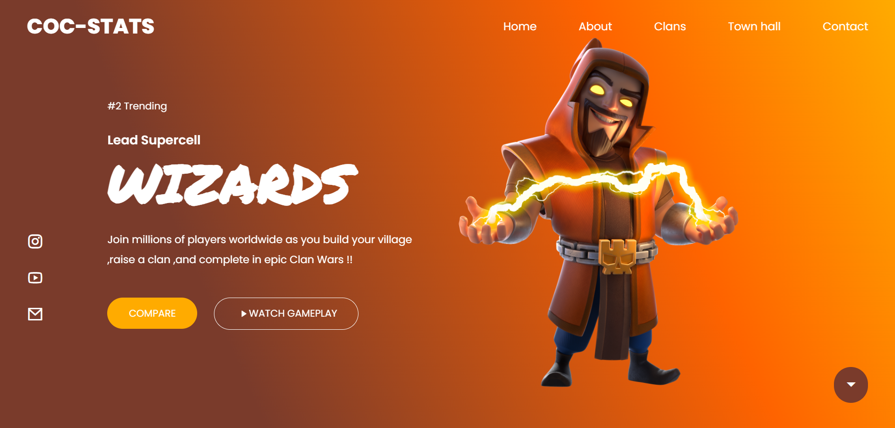

<h1><b>Gaming Website Readme</b></h1>
This is the readme file for your gaming website project, providing an overview of the project and instructions on how to set up and run the application.
 
<h2><b>Project Overview</b></h2>
 
This is just front-end  and built using HTML, CSS, and JavaScript.

<h2><b>Getting Started </b></h2>
 
To use  the gaming website code, follow these steps:
 
Clone the repository onto your local machine using Git.
bash

git clone https://github.com/YOUR-USERNAME/gaming-website.git

 
<b><h2>Application Features</h2></b>
 
The gaming website  includes the following features:
 
1.Animation on scroll
2.Responsive design
3.Gradient colour scheme
4.Supported in almost all browsers

 
<b><h2>Screenshot : </h2></b>
 

